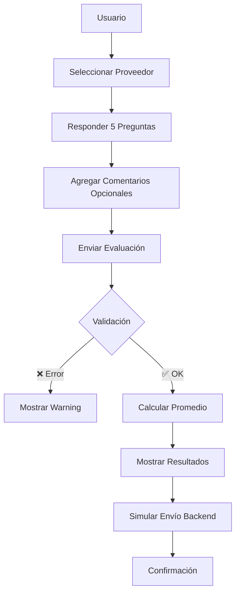

# 📊 Aplicación de Evaluación de Proveedores - SAP BTP

## 📋 Descripción

Aplicación empresarial desarrollada siguiendo las mejores prácticas de **SAP BTP Cloud** y **SAP Fiori Design Guidelines** para el módulo logístico de SAP. Permite a los compradores evaluar el desempeño de sus proveedores mediante una encuesta estructurada.

## 🎯 Características Principales

### ✅ Funcionalidades Implementadas

1. **Selección de Proveedor**: Dropdown con lista de proveedores predefinidos
2. **Sistema de Calificación**: 5 preguntas con rating de estrellas (1-5)
3. **Validación de Datos**: Verificación de campos obligatorios
4. **Cálculo Automático**: Promedio de puntajes con indicador visual
5. **Comentarios Opcionales**: Campo de texto para observaciones adicionales
6. **Resultados en Tiempo Real**: Panel dinámico con estado del proveedor
7. **Funcionalidad de Reset**: Limpiar formulario con confirmación
8. **Diseño Responsive**: Adaptable a desktop, tablet y móvil

## 📝 Las 5 Preguntas de Evaluación

### 1. **Calidad de los productos/servicios entregados**
   - Evalúa la conformidad con especificaciones técnicas
   - Verifica estándares de calidad

### 2. **Cumplimiento en tiempos de entrega**
   - Puntualidad en entregas acordadas
   - Respeto a cronogramas establecidos

### 3. **Competitividad de precios y condiciones comerciales**
   - Relación precio-calidad
   - Condiciones de pago y flexibilidad comercial

### 4. **Atención al cliente y soporte post-venta**
   - Calidad del servicio de atención
   - Resolución de problemas e incidencias

### 5. **Documentación y cumplimiento normativo**
   - Entrega de certificaciones necesarias
   - Cumplimiento de normativas legales y regulatorias

## 🎨 Criterios de Evaluación

| Puntaje | Calificación | Color | Descripción |
|---------|--------------|-------|-------------|
| 4.5 - 5.0 | Excelente | 🟢 Verde | Proveedor supera expectativas |
| 3.5 - 4.4 | Bueno | 🟢 Verde | Cumple estándares consistentemente |
| 2.5 - 3.4 | Regular | 🟡 Amarillo | Requiere plan de mejora |
| 1.0 - 2.4 | Deficiente | 🔴 Rojo | Acción inmediata requerida |

## 🏗️ Arquitectura

### Estructura de Archivos
```
app20/
├── webapp/
│   ├── controller/
│   │   └── View20.controller.ts    # Lógica de negocio
│   ├── view/
│   │   └── View20.view.xml         # Interfaz de usuario
│   ├── model/
│   │   └── formatter.ts            # Funciones helper
│   ├── css/
│   │   └── style.css               # Estilos personalizados
│   └── i18n/
│       └── i18n.properties         # Textos internacionalizados
```

### Tecnologías Utilizadas

- **SAP UI5** v1.144.1+
- **TypeScript** para type-safety
- **XML Views** para UI declarativa
- **JSON Model** para gestión de datos
- **SAP Fiori Design** guidelines
- **Responsive Design** (Desktop/Tablet/Mobile)

## 🚀 Mejores Prácticas Implementadas

### 1. **SAP Fiori Design Guidelines**
- ✅ Uso de controles SAP estándar (Panel, Form, RatingIndicator)
- ✅ Paleta de colores SAP oficial
- ✅ Iconografía SAP Icons
- ✅ Espaciado y márgenes consistentes

### 2. **Código Limpio y Mantenible**
- ✅ Separación de responsabilidades (MVC)
- ✅ Comentarios JSDoc en métodos
- ✅ Nombres descriptivos de variables y funciones
- ✅ Validaciones robustas

### 3. **Experiencia de Usuario (UX)**
- ✅ Mensajes informativos (Toast, MessageBox)
- ✅ Confirmaciones en acciones destructivas
- ✅ Feedback visual inmediato
- ✅ Tooltips explicativos

### 4. **Internacionalización (i18n)**
- ✅ Todos los textos externalizados
- ✅ Preparado para múltiples idiomas
- ✅ Formato de fecha localizado

### 5. **Accesibilidad**
- ✅ Labels asociados a controles
- ✅ Campos obligatorios marcados
- ✅ Alto contraste soportado
- ✅ Navegación por teclado

### 6. **Performance**
- ✅ Lazy loading de vistas
- ✅ Modelos JSON ligeros
- ✅ Renderizado eficiente
- ✅ Transiciones CSS optimizadas

## 💻 Instalación y Ejecución

### Prerrequisitos
- Node.js v14+
- npm v6+
- SAP UI5 CLI (opcional)

### Instalación
```bash
cd app20
npm install
```

### Ejecución Local
```bash
npm start
```
La aplicación estará disponible en: `http://localhost:8080/index.html`

### Build para Producción
```bash
npm run build
```

## 📊 Flujo de Datos



## 🔧 Próximas Mejoras Sugeridas

### Backend Integration
- [ ] Conectar con servicio OData para proveedores reales
- [ ] Persistir evaluaciones en base de datos
- [ ] Implementar autenticación de usuario

### Funcionalidades Adicionales
- [ ] Histórico de evaluaciones por proveedor
- [ ] Dashboard de analytics con gráficos
- [ ] Exportar resultados a PDF/Excel
- [ ] Notificaciones a proveedores
- [ ] Workflow de aprobación
- [ ] Comparativa entre proveedores

### Mejoras Técnicas
- [ ] Unit tests con QUnit
- [ ] Integration tests con OPA5
- [ ] CI/CD pipeline
- [ ] Logging centralizado
- [ ] Error handling avanzado

## 📱 Screenshots

### Vista Principal
- Selector de proveedor
- 5 preguntas con rating visual
- Campo de comentarios
- Botones de acción

### Resultados
- Puntaje promedio con barra de progreso
- Estado del proveedor (Success/Warning/Error)
- Mensaje interpretativo del resultado

## 🔐 Seguridad

- Validación de entrada en cliente
- Límites de caracteres en campos de texto
- Sanitización de datos (preparado para backend)
- Manejo seguro de datos sensibles

## 📚 Referencias

- [SAP Fiori Design Guidelines](https://experience.sap.com/fiori-design/)
- [UI5 Documentation](https://ui5.sap.com/)
- [SAP BTP Best Practices](https://help.sap.com/docs/btp)

## 👥 Uso en Producción

### Integración con SAP Work Zone
Esta aplicación está diseñada para integrarse en **SAP Work Zone** mediante:
- Cross-navigation configurado en manifest.json
- Semantic object: `hello20` / Action: `ver`
- Compatible con Launchpad Fiori

### Datos de Ejemplo Incluidos
```javascript
Proveedores:
- V001: Proveedor ABC S.A.
- V002: Distribuidora XYZ Ltda.
- V003: Suministros Global Corp.
- V004: Materiales Express SpA
- V005: Comercial Pacific Inc.
```

## 📧 Soporte

Para consultas o reportar issues, contactar al equipo de desarrollo.

---

**Desarrollado con ❤️ siguiendo SAP BTP Best Practices**
